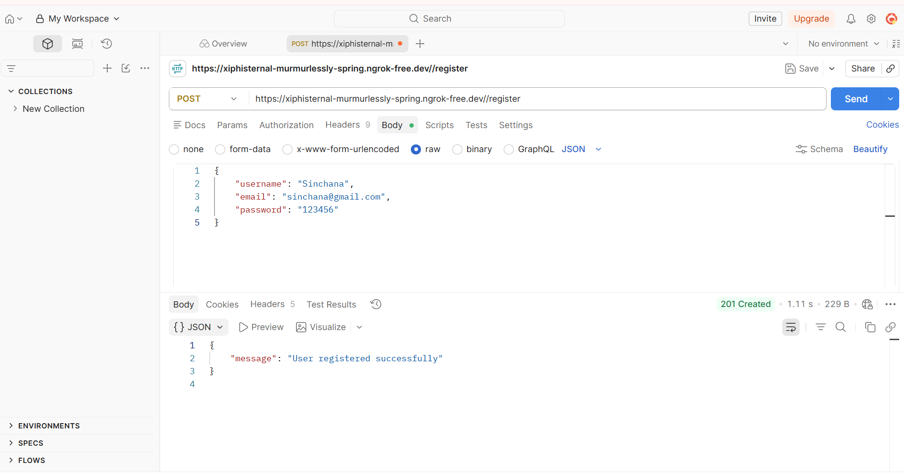
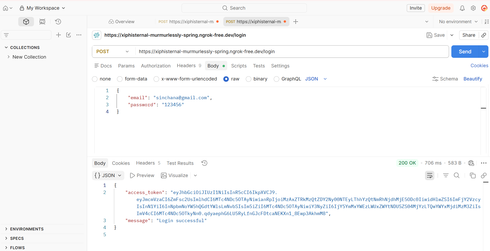
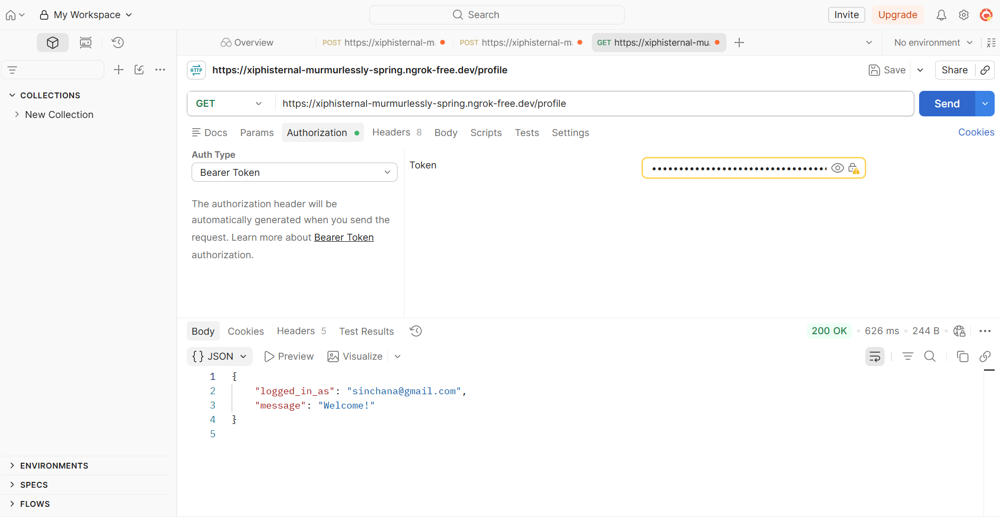
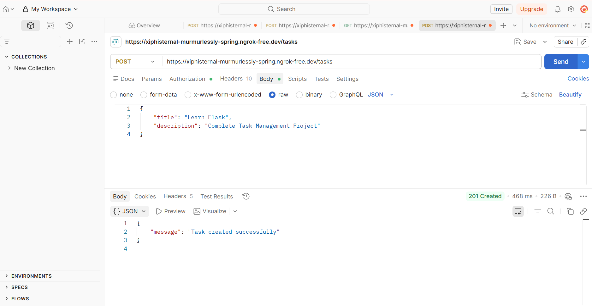
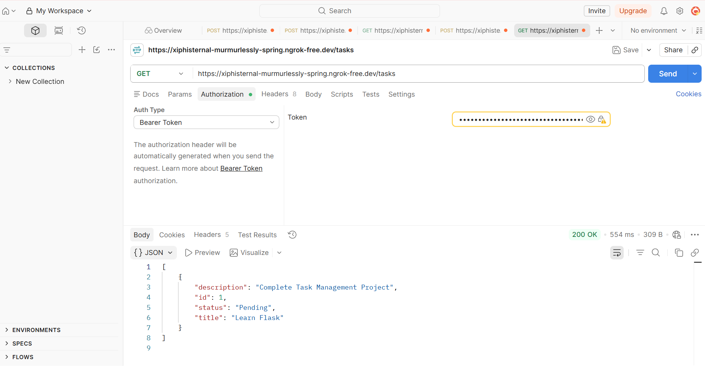
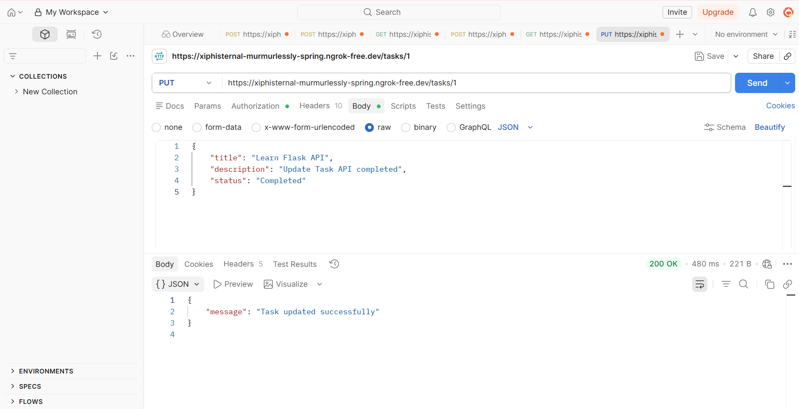
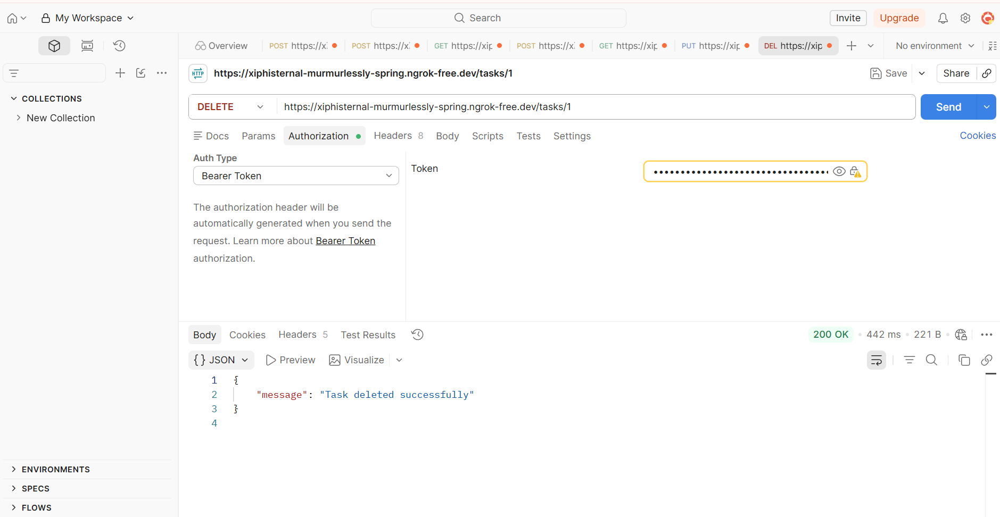

# Task Management API

This is a simple Task Management REST API developed using Flask. It allows users to register, login using JWT authentication, and perform CRUD operations on tasks.

## Features

- User Registration
- User Login
- JWT Authentication
- Create Task
- View Tasks
- Update Task
- Delete Task
- Filter Tasks by Status

## Technologies Used

- Python
- Flask
- Flask SQLAlchemy
- SQLite
- Flask-JWT-Extended
- Werkzeug

## Run the Project

Install the required packages

```bash
pip install -r requirements.txt
```

Run the project

```bash
python app.py
```

The server runs locally on:

```
http://127.0.0.1:5000
```

This is a backend API project, so it can be tested using Postman.

## API Endpoints

### User

- POST /register
- POST /login
- GET /profile

### Tasks

- POST /tasks
- GET /tasks
- PUT /tasks/<id>
- DELETE /tasks/<id>
- GET /tasks?status=Completed

## API Testing Results

### User Registration



---

### User Login



---

### User Profile



---

### Create Task



---

### Get Tasks



---

### Update Task



---

### Delete Task



## Author

Sinchana RB
